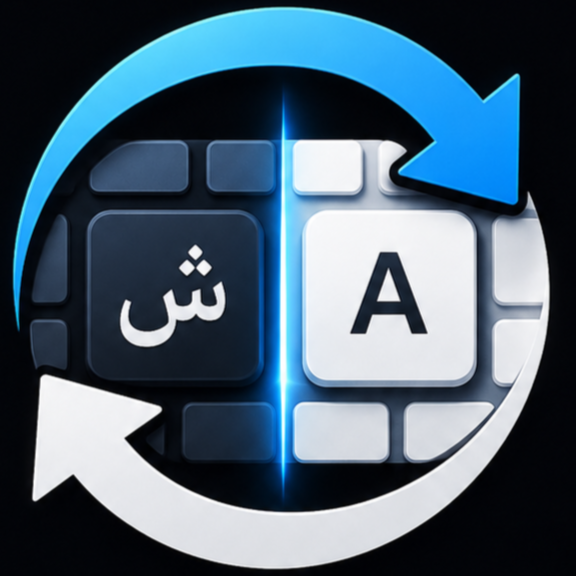

<div align="center">



# Switch — محول تخطيط لوحة المفاتيح

**تطبيق C# لويندوز يحول النص المكتوب بتخطيط عربي أو إنجليزي خاطئ بضغطة واحدة.**

</div>

## الاستخدام

1. شغّل `Switch.exe`.
2. حدد النص في أي تطبيق.
3. اضغط `Ctrl + Shift + Space`.

سيستبدل Switch النص المحدد بالناتج المحول بين Arabic 101 وEnglish QWERTY. يظهر التطبيق كأيقونة في منطقة الإشعارات؛ اضغط عليها بالزر الأيمن ثم اختر **خروج** لإيقافه.

## البنية

```text
Switch/
├── Program.cs                  نقطة تشغيل تطبيق Windows Forms (STA)
├── HotkeyWindow.cs             الاختصار العام، الحافظة، وأيقونة شريط المهام
├── KeyboardLayoutConverter.cs  خريطة Arabic 101 ↔ QWERTY ومنطق التحويل
├── NativeMethods.cs            استدعاءات Win32 الضرورية
├── SelfTests.cs                اختبارات التحويل المدمجة
└── Switch.csproj               مشروع .NET Framework 4.8
```

## المتطلبات والبناء

- Windows مع **.NET Framework 4.8**.
- Visual Studio 2022 أو Build Tools مع **.NET Framework 4.8 Developer Pack / Targeting Pack** للبناء.
- Inno Setup اختياريًا لبناء المثبّت.

```powershell
MSBuild .\Switch\Switch.csproj /t:Rebuild /p:Configuration=Release
```

ينتج الملف التنفيذي في `Switch\bin\Release\Switch.exe`. بعد ذلك شغّل `setup.iss` في Inno Setup لإنتاج `Output\Switch_Setup.exe`.

## ملاحظات تقنية

- لا توجد حزم NuGet أو عمليات شبكة؛ يعتمد التطبيق على Windows Forms وWin32 فقط.
- يُسجَّل الاختصار عبر `RegisterHotKey`، وهو أكثر ثباتًا من مراقبة keyboard hook في التنفيذ السابق.
- تُحفظ الحافظة النصية وتُستعاد بعد التحويل. أما عناصر الحافظة غير النصية (مثل الصور والملفات) فلا يمكن الحفاظ عليها بالواجهة المُدارة الحالية.

## الرخصة

مرخص تحت [MIT](LICENSE).
